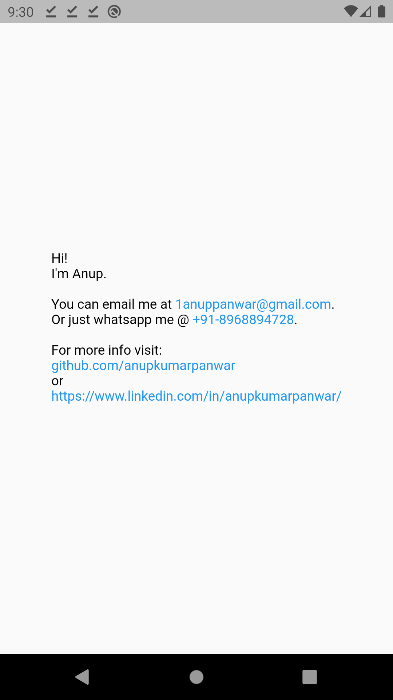

# linkable [](https://pub.dartlang.org/packages/linkable)

A Flutter widget to add links to your text. By default, the `Text` or `RichText` widgets render the URLs in them as simple text which are not clickable. So, `Linkable` widget is a wrapper over `RichText` which allows you to render links that can be clicked to redirect to the URL. That means that a `Linkable` widget supports all the attributes of a `RichText` Widget.

Currently linkable supports the following types:
- Web URL (https://www.github.com/anupkumarpanwar)
- Emails (mailto:1anuppanwar@gmail.com)
- Phone numbers (tel:+918968894728)

Note: You don't need to specify the URL scheme (mailto, tel etc). The widget will parse it automatically.

## Install
To install the package, add the following dependency to your `pubspec.yaml`
```
dependencies:
  linkable: ^3.0.1
  url_launcher: ^6.0.9
```
### Android

Starting from API30 (Android 11), your Android app has to list all apps it interacts with.

The following is required in AndroidManifest.xml or links will fail to launch.

```
<manifest>

    <!-- Nest within the manifest element, not the application element-->
    <queries>
        <intent>
            <action android:name="android.intent.action.VIEW" />
            <data android:scheme="https" />
        </intent>
        <intent>
            <action android:name="android.intent.action.DIAL" />
            <data android:scheme="tel" />
        </intent>
        <intent>
            <action android:name="android.intent.action.SEND" />
            <data android:mimeType="*/*" />
        </intent>
    </queries>

    <application>
        ....
    </application>
</manifest>
```

## Usage
### Basic
```
import 'package:linkable/linkable.dart';

Linkable(
	text:
	"Hi!\nI'm Anup.\n\nYou can email me at 1anuppanwar@gmail.com.\nOr just whatsapp me @ +91-8968894728.\n\nFor more info visit: \ngithub.com/anupkumarpanwar \nor\nhttps://www.linkedin.com/in/anupkumarpanwar/",
);
```

### Attributes
| Key  				| Description   												   	|
|-------------------|-------------------------------------------------------------------|
| `text` 			| The text to be displayed in the widget.  							|
| `textColor` 		|  Color of the non-link text. (default: black)						|
| `linkColor` 		|  Color of the links. (default: blue) 								|
| `style` 			|  TextStyle to be applied on the widget. 							|
| `textAlign` 		|  TextAlign value. (default: TextAlign.start)						|
| `textDirection` 	|  Determines the order to lay children out horizontally. 			|
| `maxLines` 		|  Maximum number of lines to be displayed. 						|
| `textScaleFactor`	|  The number of font pixels for each logical pixel. 				|

## Screenshot

